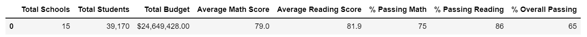
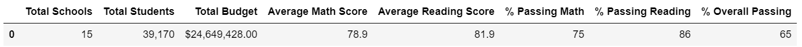
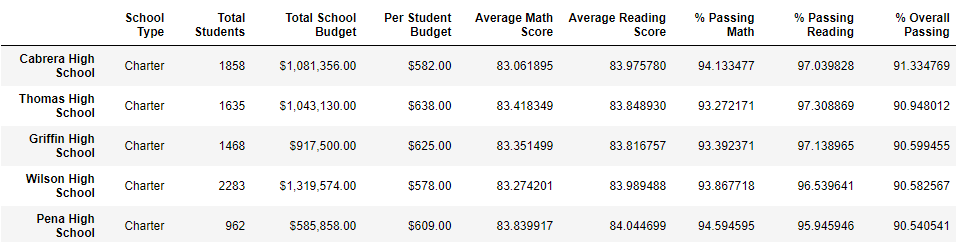
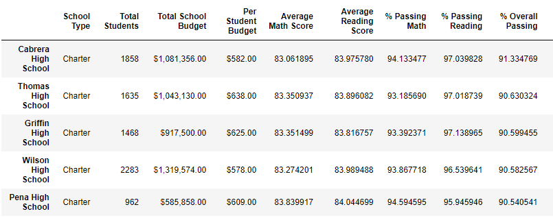
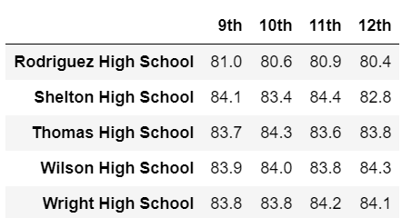
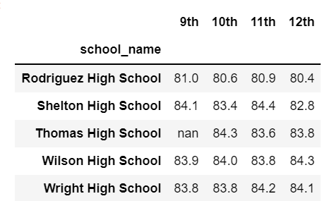
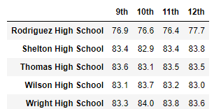
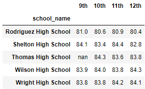
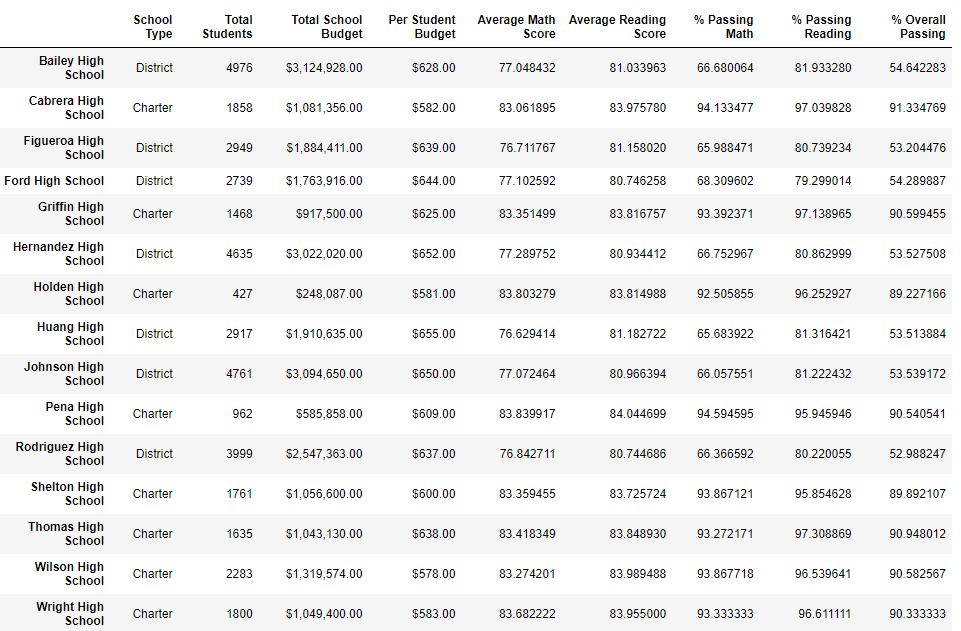
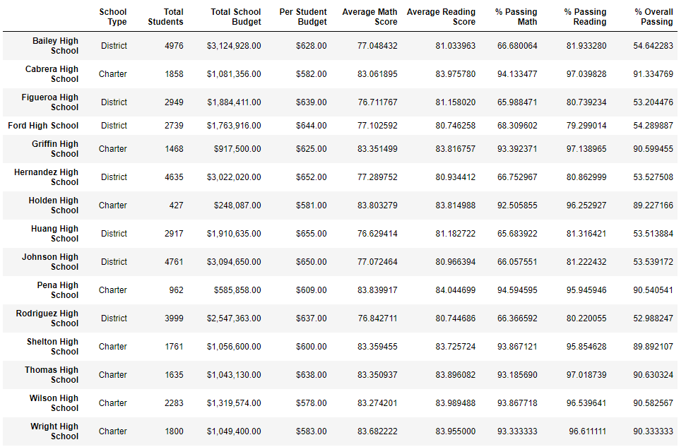

# School_District_Analysis
Python Anaconda Bootcamp
## Overview of Project
This project focuses on using Jupyter notebook, Pandas functions, etc. to provide a summary of District test scores based on grade level, size of school, average scores, etc. This project focuses on looking at data once more without Thomas High School Data 9th grade data which shows there may have been tampering.
### Purpose
Learn to update existing data by removing Thomas 9th grade data and recreating previous analysis based on new data.

## Results
- **How is the district summary affected?**

     *Original*

     *Without Thomas High School 9th graders*

    The district summary takes into account all schools. Because of this, removing only the 9th graders from Thomas high school barely changes the data. There was a slight drop in math average score. It went from 79% to 78.9 %. The average reading score did not change much, and neither did the Percent passing math, percent passing reading, and overall percent.

- **How is the school summary affected?**

     *Original*

     *Without Thomas High School 9th graders*

    The School Summary was also affected. Looking at the average math score, this dropped from about 83.42 percent to 83.35 percent. Interestingly, the average reading score increased from 83.85 percent to 83.90 percent. With that, the Percent passing math decreased from 93.27 percent to 93.19 percent. With the increase reading scores,  that increased from 97.31 percent to 97.02 percent. This suggests that the 9th grades were responsible for the higher score but was dragging down the score for reading. The overall passing did drop due to the removed data dropping it from 90.94 percent to 90.63 percent.

- **How does replacing the ninth graders’ math and reading scores affect Thomas High School’s performance relative to the other schools?**

    Although their overall passing score did drop, from 90.94 to 90.63 percent, but overall, even without the ninth graders, their score was still higher than Griffin high school's overall score at 90.60% They were still the second best overall passing school.

- **How does replacing the ninth-grade scores affect the following:**
    - **Math and reading scores by grade**
        - As can be seen in the images below, the only different is that now there are no 9th grade scores available for reading and math. None of the other scores changed. This is specifically looking at the tail of each.
     *Original Reading*

     *Without Thomas High School 9th graders Reading*

     *Original Math* 

     *Without Thomas High School 9th graders Math*

    - **Scores by school spending**
        - Looking at spending ranges per student, this did not change. There was no added calculation to remove students from data, therefore the calculation remained the same. This was 638 initially. Removing students also removes budget for the students, so the calculation would have made it seem as though the students were given more money if I had just subtracted students. Regardless of how the students cheated, the budget was still spent the same.

     *Original*

     *Without Thomas High School 9th graders*

        

    - **Scores by school size**
        - Similar to above, there was no change in the calculation. If the directions had prompted me to change the total students from total scores, perhaps it would have changed the calculation. The school remains a medium size school. Even if the calculation was adjusted, there were still over 1000 students and less than 2000 so it would not have changed.

    - **Scores by school type**
       - Similar to above, there was no change in the calculation for school type. Thomas High School remains a charter regardless.

## Summary
- Overall, removing the data only changed scores in the 9th grade columns, and did affect the average scores in both topics, percent passing in both topics, and overall passing of both topics. The math average decreased suggesting that their higher scores were leading to higher percent passing in math as well as more people passing overall. The reading score, when removed, increased suggesting their reading scores actually were bringing down the scores for reading. Because less students passed both as driven down by the math score, they did drop their overall score. Other items like the school's budget, total students, type of school being a charter, etc. did not change regardless if there was cheating in the 9th grade class at Thomas High School.